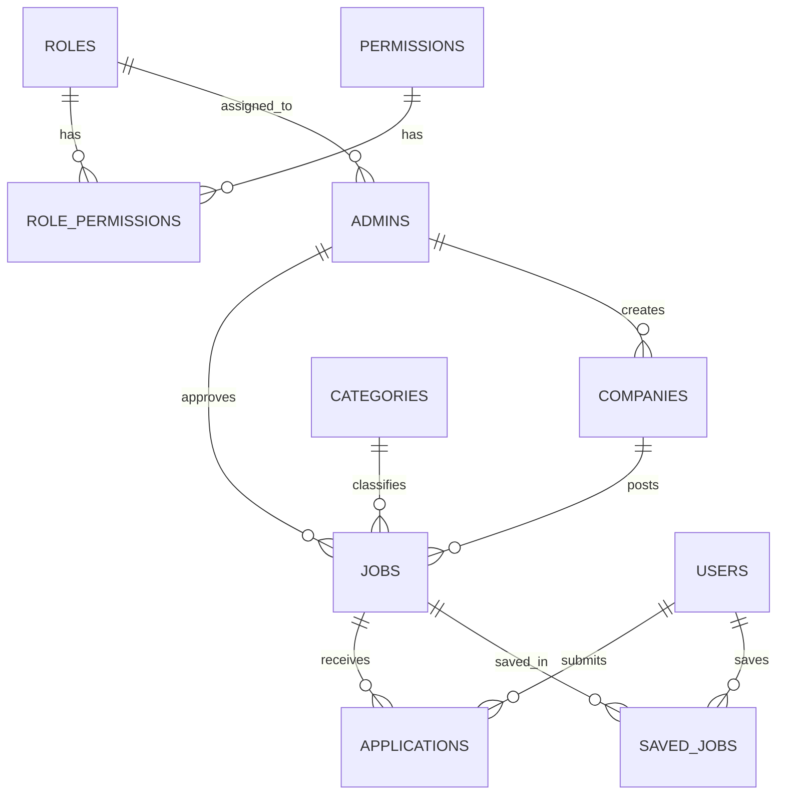

# DATABASE.md — JobHub

> Assumption: ORM = **TypeORM** (default pairing with NestJS + MySQL, supports migration-based versioning required in §5). Swap notes for Prisma are in §6 if the team prefers it instead.

## Core Features

- **auth**: refresh_tokens (uses `users`/`admins`)
- **users**: users
- **admins**: admins
- **roles-permissions**: roles, permissions, role_permissions
- **companies**: companies
- **jobs**: jobs, categories, saved_jobs
- **applications**: applications

---

## 1. Overview

- **Database**: MySQL 8.x, `InnoDB` engine, `utf8mb4_unicode_ci` charset
- **ORM**: TypeORM (repository pattern, one `entity.ts` per table, colocated inside its feature module, e.g. `src/modules/jobs/entities/job.entity.ts`)
- **Migrations**: TypeORM CLI migrations (SQL-based, not `synchronize: true` — disabled outside local dev)
- **Naming conventions**:
  | Object | Convention | Example |
  |---|---|---|
  | Table | plural, snake_case | `jobs`, `saved_jobs` |
  | Column | snake_case | `company_id`, `created_at` |
  | FK column | `<singular_table>_id` | `job_id` |
  | Index | `idx_<table>_<col(s)>` | `idx_jobs_status` |
  | Unique constraint | `uq_<table>_<col(s)>` | `uq_users_email` |
  | Enum values | snake_case string | `'full_time'` |

---

## 2. Entities by Feature

### Feature: users
**`users`**
| Field | Type | Constraints |
|---|---|---|
| id | BIGINT UNSIGNED | PK, AUTO_INCREMENT |
| full_name | VARCHAR(150) | NOT NULL |
| email | VARCHAR(190) | NOT NULL, UNIQUE |
| password_hash | VARCHAR(255) | NOT NULL |
| phone | VARCHAR(30) | NULL |
| resume_url | VARCHAR(500) | NULL |
| is_active | BOOLEAN | DEFAULT true |
| deleted_at | DATETIME | NULL |

Indexes: `uq_users_email(email)`, `idx_users_deleted_at(deleted_at)`

### Feature: admins
**`admins`**
| Field | Type | Constraints |
|---|---|---|
| id | BIGINT UNSIGNED | PK |
| full_name | VARCHAR(150) | NOT NULL |
| email | VARCHAR(190) | NOT NULL, UNIQUE |
| password_hash | VARCHAR(255) | NOT NULL |
| role_id | BIGINT UNSIGNED | FK → roles.id, NOT NULL |
| is_active | BOOLEAN | DEFAULT true |
| deleted_at | DATETIME | NULL |

Indexes: `uq_admins_email(email)`, `idx_admins_role_id(role_id)`

### Feature: roles-permissions
**`roles`** | id PK, name VARCHAR(60) UNIQUE, description VARCHAR(255) NULL
**`permissions`** | id PK, name VARCHAR(100) UNIQUE, method ENUM(GET,POST,PATCH,PUT,DELETE), route VARCHAR(150), description VARCHAR(255) NULL

Indexes: `uq_permissions_method_route(method, route)`, `uq_permissions_name(name)`

**`role_permissions`** (junction)
| Field | Type | Constraints |
|---|---|---|
| role_id | BIGINT UNSIGNED | PK (composite), FK → roles.id |
| permission_id | BIGINT UNSIGNED | PK (composite), FK → permissions.id |

### Feature: companies
**`companies`**
| Field | Type | Constraints |
|---|---|---|
| id | BIGINT UNSIGNED | PK |
| name | VARCHAR(200) | NOT NULL |
| slug | VARCHAR(220) | UNIQUE |
| logo_url | VARCHAR(500) | NULL |
| description | TEXT | NULL |
| size | ENUM('1-10','11-50','51-200','201-500','500+') | NULL |
| created_by | BIGINT UNSIGNED | FK → admins.id |
| deleted_at | DATETIME | NULL |

Indexes: `uq_companies_slug(slug)`, `idx_companies_created_by(created_by)`

### Feature: jobs
**`categories`** | id PK, name VARCHAR(100) UNIQUE, slug VARCHAR(120) UNIQUE

**`jobs`**
| Field | Type | Constraints |
|---|---|---|
| id | BIGINT UNSIGNED | PK |
| company_id | BIGINT UNSIGNED | FK → companies.id |
| category_id | BIGINT UNSIGNED | FK → categories.id |
| title | VARCHAR(200) | NOT NULL |
| slug | VARCHAR(220) | UNIQUE |
| description | TEXT | NOT NULL |
| employment_type | ENUM('full_time','part_time','contract','internship','remote') | NOT NULL |
| salary_min / salary_max | DECIMAL(12,2) | NULL |
| status | ENUM('draft','pending_review','published','closed','rejected') | DEFAULT 'draft' |
| expires_at | DATETIME | NULL |
| approved_by | BIGINT UNSIGNED | FK → admins.id, NULL |
| deleted_at | DATETIME | NULL |

Indexes: `idx_jobs_company_id`, `idx_jobs_category_id`, `idx_jobs_status_expires_at(status, expires_at)`, `uq_jobs_slug(slug)`

**`saved_jobs`** (junction, no surrogate id)
| Field | Type | Constraints |
|---|---|---|
| user_id | BIGINT UNSIGNED | PK (composite), FK → users.id |
| job_id | BIGINT UNSIGNED | PK (composite), FK → jobs.id |

### Feature: applications
**`applications`**
| Field | Type | Constraints |
|---|---|---|
| id | BIGINT UNSIGNED | PK |
| job_id | BIGINT UNSIGNED | FK → jobs.id |
| user_id | BIGINT UNSIGNED | FK → users.id |
| resume_url | VARCHAR(500) | NOT NULL (snapshot) |
| status | ENUM('pending','reviewed','shortlisted','rejected','accepted') | DEFAULT 'pending' |
| reviewed_by | BIGINT UNSIGNED | FK → admins.id, NULL |

Indexes: `uq_applications_job_user(job_id, user_id)`, `idx_applications_user_id`, `idx_applications_status`

### Shared entities
- `refresh_tokens` (auth module) — polymorphic `owner_id` + `owner_type ENUM('user','admin')`

---

## 3. Relationships

**Conventions**: FK always named `<table>_id`; every FK has an index; `ON DELETE RESTRICT` by default, `ON DELETE CASCADE` only for junction tables (`role_permissions`, `saved_jobs`).

**Cross-feature relationships**: DB-level FKs are normalized across modules (e.g. `jobs.company_id → companies.id`), but at the code level a feature only queries its own repository directly — it reads related data via the owning feature's service (e.g. `ApplicationsService` calls `JobsService`, never queries `jobs` table directly), keeping modules loosely coupled despite a fully relational schema.

---

## 4. Conventions

- **Primary key**: `BIGINT UNSIGNED AUTO_INCREMENT` for all entities (simple, indexed-efficient for MySQL; UUIDs only if a table is exposed to external sync/replication — none currently)
- **Soft delete**: `deleted_at DATETIME NULL` on `users`, `admins`, `jobs`, `companies` only (tables needing history); everything else hard-deletes
- **Timestamps**: `created_at`, `updated_at` on every table (`DEFAULT CURRENT_TIMESTAMP`, `ON UPDATE CURRENT_TIMESTAMP`); junction tables have `created_at` only
- **Enum/status handling**: native MySQL `ENUM` for fixed, rarely-changing sets (job status, application status, employment type); lookup tables (`categories`, `permissions`) when the set grows or needs metadata

---

## 5. Migration Rules

- **Naming**: `{timestamp}-{verb}-{description}.ts`, e.g. `1717000000000-create-jobs-table.ts`
- **Generation**: `npm run typeorm migration:generate -- -n CreateJobsTable` (never hand-edit generated SQL without review)
- **Versioning**: one migration per logical schema change; never edit a migration after it's merged to `main` — write a new one
- **Rollback**: every migration implements both `up()` and `down()`; `down()` must be tested locally before merge
- **Execution order**: matches feature build order — `users`/`admins` → `roles`/`permissions` → `companies`/`categories` → `jobs` → `applications`/`saved_jobs` → `refresh_tokens`

## 6. TypeORM-Specific Patterns

- One `*.entity.ts` per table, colocated in `src/modules/<feature>/entities/`
- `synchronize: false` in all environments except local scratch DB — schema changes only via migrations
- Relations declared with `@ManyToOne`/`@OneToMany` + explicit `@JoinColumn({ name: 'company_id' })` to keep column names snake_case while entity properties stay camelCase
- Repositories injected per-feature (`@InjectRepository(Job)`); no feature imports another feature's repository — use the other feature's service instead
