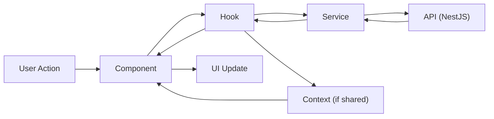

# ARCHITECTURE.md — Frontend (Feature-based)

> Stack: Next.js (App Router) + TypeScript + Tailwind CSS + React Context + native `fetch`. Companion docs: `API_SPEC.md` (endpoints/contracts), `PROJECT-RULES-FRONTEND.md` (conventions/anti-patterns).

## 1. Overview

**Feature-based architecture**: each domain (`jobs`, `applications`, `companies`, ...) is a vertical slice owning its components, hooks, services, types, and local state — mirroring the backend's feature modules and `API_SPEC.md`'s "Endpoints by Feature" grouping 1:1. A developer working on the applications flow touches one folder, not scattered `components/`, `hooks/`, `services/` directories across the whole app.

**Tech stack justification**:
- **Next.js App Router**: Server Components let pages fetch data server-side (closer to the NestJS API, less client JS shipped) while Client Components handle interactivity — fits a job board where most pages (listings, job detail) are read-heavy and benefit from SSR.
- **React Context (no external state lib)**: team size is 5 and app-wide shared state is limited to auth/session — Context + local `useState` covers this without adding a dependency; revisit only if cross-cutting state grows significantly.
- **Native `fetch`**: no extra HTTP client dependency; works identically in Server and Client Components, pairs with Next.js's built-in caching (`next: { revalidate }`).
- **Tailwind CSS**: utility-first, keeps styles co-located with components per feature, no separate CSS file sprawl.

---

## 2. Folder Structure

```
src/
├── app/                        # Next.js App Router — routes only, no business logic
│   ├── layout.tsx              # root layout + global providers
│   ├── page.tsx                # entry point (home)
│   ├── (public)/jobs/          # route segments compose features/*
│   └── admin/                  # protected admin route segments
├── shared/
│   ├── components/             # Button, Modal, Pagination, Skeleton
│   ├── hooks/                  # useDebounce, useMediaQuery
│   ├── services/
│   │   └── api-client.ts       # fetch wrapper: base URL, auth header, error normalization
│   ├── context/                # AuthContext, ToastContext (global only)
│   ├── types/                  # ApiResponse<T>, ApiError, PaginationMeta
│   └── utils/                  # formatDate, slugify
├── features/
│   ├── auth/
│   ├── users/
│   ├── admins/
│   ├── roles-permissions/
│   ├── companies/
│   ├── jobs/
│   └── applications/
├── assets/                     # images, icons, static files
└── styles/                     # globals.css, tailwind.config.ts entry
```

- `features/*` names match `API_SPEC.md` §6 feature groupings exactly (`jobs`, `applications`, etc.)
- `shared/stores` from the template is renamed `shared/context` — see §7 (no external store library).

---

## 3. Feature Anatomy

```
features/jobs/
├── components/
│   ├── job-card.tsx
│   └── job-filter-bar.tsx
├── hooks/
│   └── use-jobs.ts             # calls services/, exposes { data, isLoading, error }
├── services/
│   └── jobs.service.ts         # fetch calls to /jobs* (API_SPEC.md §6 "jobs")
├── context/
│   └── job-filters.context.tsx # optional, only if 2+ components in-feature share state
├── types/
│   └── job.types.ts            # mirrors API_SPEC.md response shapes
├── utils/
│   └── format-salary.ts
├── pages/                      # optional: page-level composition used by app/ routes
│   └── job-listing.page.tsx
├── index.ts                    # public barrel — the feature's only import surface
└── context.md
```

---

## 4. Data Flow



- **Component**: renders, delegates events to the hook — no `fetch`, no business logic
- **Hook**: owns loading/error/data state, calls the service, optionally reads/writes feature or global Context
- **Service**: pure `fetch` calls to one feature's endpoints (per `API_SPEC.md`), returns typed data — no React, no state
- **Context**: only touched when state must outlive a single component tree or cross features (auth) — most flows skip it entirely (component ↔ hook ↔ service is the default path)

---

## 5. Cross-feature Communication

| Method | Use case |
|---|---|
| Global Context (`shared/context/`) | Auth/session (current user, tokens), toast notifications |
| URL / Router | Navigation with params — filters, pagination, selected job id |
| Event emitter (`shared/utils/event-bus.ts`) | Rare decoupled side effects (e.g. "application submitted" triggers a saved-jobs badge refresh without direct coupling) |

No feature imports another feature's internals (see `PROJECT-RULES-FRONTEND.md` §3/§6). A page composing two features (e.g. job detail page showing company info) imports both via their `index.ts` barrels only.

---

## 6. Routing Structure

- **Public routes**: `/jobs`, `/jobs/[slug]`, `/companies`, `/companies/[slug]`, `/login`, `/register` — matches `API_SPEC.md` `Auth: Public` rows
- **Protected routes**: `/me/*` (user, requires session), `/admin/*` (admin, requires session + RBAC permission matching `API_SPEC.md` `Admin (permission)` rows)
- **Route config per feature**: each `app/` segment is a thin wrapper importing a `features/<feature>/pages/*.page.tsx` component; auth/role checks happen in `layout.tsx` for the segment (`app/admin/layout.tsx` guards all `/admin/*`)
- **Lazy loading**: heavy client-only components (rich text editor for job description, charts on admin dashboard) use `next/dynamic` with `ssr: false`; route-level code-splitting is automatic via the App Router's per-segment bundling

---

## 7. State Management Strategy

| State Type | Location | Example |
|---|---|---|
| Server state | Feature hook (`use-*.ts`) + `fetch`, no cache lib | Job list, application list |
| Global UI | `shared/context/UIContext` | Toast queue, mobile nav open |
| Auth | `shared/context/AuthContext` | Current user, access token, role |
| Feature state | Feature-local Context (only if needed) | Multi-step job-post form draft |
| Local UI | Component `useState` | Modal open, dropdown expanded |

No dedicated "server state cache" library (TanStack Query, SWR) is in scope — each hook manages its own `data/isLoading/error` via `useState`/`useEffect`. Revisit if refetch-on-focus, polling, or optimistic updates become common needs; the `services/*.service.ts` layer stays unchanged either way.

---

## 8. API Layer

```
shared/services/api-client.ts        # fetch wrapper: baseURL, auth header, JSON parsing, ApiError normalization
        ↓
features/jobs/services/jobs.service.ts   # typed calls: getJobs(), getJobBySlug(), applyToJob()
        ↓
features/jobs/hooks/use-jobs.ts          # { data, isLoading, error } for components
        ↓
features/jobs/components/job-list.tsx    # renders, no fetch/business logic
```

`api-client.ts` reads the access token from `AuthContext` (via a getter, not a React hook, so it's usable in Server Components too), attaches `Authorization: Bearer <token>`, and maps `API_SPEC.md` §4 error envelopes (`error.code`) into a typed `ApiError` every hook can branch on (e.g. `APPLICATIONS_002` → show "already applied" inline instead of a generic toast).

---

## 9. Shared vs Features

| Shared (`src/shared/`) | Features (`src/features/*`) |
|---|---|
| Generic UI components (Button, Modal, Skeleton) | Feature-specific components (JobCard, ApplicationStatusBadge) |
| `api-client.ts` (base fetch wrapper) | Feature services (`jobs.service.ts`) calling specific endpoints |
| Global hooks (`useDebounce`, `useMediaQuery`) | Feature hooks (`useJobs`, `useApplyToJob`) |
| Cross-cutting utils (`formatDate`, `slugify`) | Feature utils (`formatSalary`, job-specific Zod schemas) |
| `AuthContext`, `ToastContext` (app-wide) | Feature-local Context (rare, e.g. multi-step form draft) |

Rule of thumb: **shared = no feature-specific knowledge, safe to import anywhere; features = owns domain logic for one slice, imported only via its own `index.ts`.**

---

## [TECH-SPECIFIC ADDITIONS]

- **SSR/SSG**: job listing (`/jobs`) and job detail (`/jobs/[slug]`) use Server Components with `fetch(..., { next: { revalidate: 60 } })` (ISR-like, 60s) for SEO and freshness; `/admin/*` pages are Server Components too but fetch with `cache: 'no-store'` (always fresh, session-gated) since they're behind auth and not indexed
- **Server Component data fetching**: calls the same `features/<feature>/services/*.service.ts` functions used client-side — the `fetch` call is environment-agnostic, only the `Authorization` source differs (cookie-based session token read server-side vs. `AuthContext` client-side)
- **Client Component data fetching**: uses the feature's `use-*.ts` hook; never both SSR-fetch and client-hook-fetch the same resource on one page (avoid duplicate requests/hydration mismatch)
- **Middleware**: `middleware.ts` at the root handles auth redirect for `/admin/*` and `/me/*` before the route even renders (checks session cookie presence; fine-grained RBAC permission check still happens in `layout.tsx`/API, middleware is coarse-grained only)
- **Context provider nesting**: `app/layout.tsx` wraps `AuthProvider` + `ToastProvider` only; feature-local providers (e.g. `JobFiltersProvider`) live in that feature's own route segment layout, never in the root
