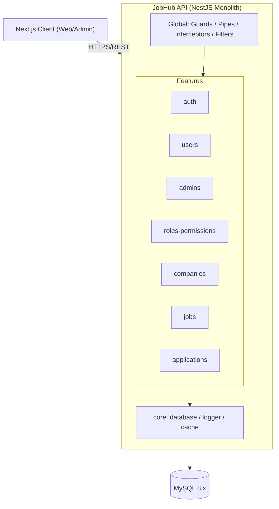
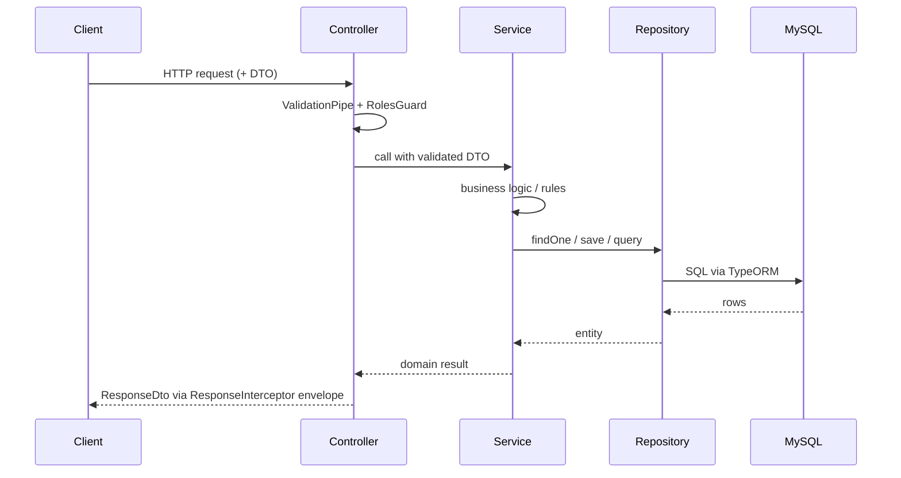

# ARCHITECTURE.md — Backend (Feature-based)

> Stack: TypeScript + NestJS + TypeORM + MySQL 8.x (Monolith). Companion docs: `DATABASE.md` (schema), `PROJECT-RULES.md` (conventions/anti-patterns).

## 1. System Overview



**Feature-based rationale**: each feature (`jobs`, `applications`, `companies`, ...) is a vertical slice owning its own controller → service → repository → entities, matching `DATABASE.md`'s "Entities by Feature" grouping 1:1. This keeps a change to one domain (e.g. adding a job status) inside one folder, lets 5 developers work on different features without merge conflicts, and keeps the monolith scalable to extract a feature into a microservice later if ever needed — since it already has no internal cross-feature imports (`PROJECT-RULES.md` §3).

---

## 2. Folder Structure

```
src/
├── config/                    # env schema + typed config loader (@nestjs/config)
│   ├── app.config.ts
│   ├── database.config.ts
│   └── validation.schema.ts
├── shared/                    # reusable, stateless, no business logic
│   ├── decorators/            # @RequirePermission, @CurrentUser
│   ├── guards/                # RolesGuard
│   ├── filters/                # HttpExceptionFilter
│   ├── interceptors/          # ResponseInterceptor, LoggingInterceptor
│   ├── pipes/
│   ├── utils/                 # pagination, slugify, date helpers
│   └── types/                 # PaginatedResult<T>, ApiResponse<T>
├── core/                      # infrastructure, framework-level singletons
│   ├── database/              # TypeORM DataSource, base repository
│   ├── logger/                # Logger provider/config
│   └── cache/                 # Redis/cache module (if/when added)
└── modules/
    ├── auth/                  # refresh_tokens; login/refresh/logout
    ├── users/                 # users
    ├── admins/                # admins
    ├── roles-permissions/     # roles, permissions, role_permissions
    ├── companies/             # companies
    ├── jobs/                  # jobs, categories, saved_jobs
    └── applications/          # applications
```

- `shared/` vs `core/` distinction is functional, see §6.
- Every folder under `modules/` maps directly to a "Feature" section in `DATABASE.md`.

---

## 3. Feature Anatomy

```
modules/jobs/
├── jobs.controller.ts     # routing, DTO validation, calls service, maps to ResponseDto
├── jobs.service.ts        # business logic (e.g. status transitions, approval rules)
├── jobs.repository.ts     # TypeORM queries only — no business logic
├── dto/
│   ├── create-job.dto.ts
│   └── job-response.dto.ts
├── entities/
│   └── job.entity.ts      # maps to `jobs` table (see DATABASE.md §2)
├── types/
│   └── jobs.types.ts
├── utils/
│   └── job-slug.util.ts
├── tests/
│   └── jobs.service.spec.ts
├── jobs.module.ts         # imports, providers, controllers, exports (public surface)
└── context.md             # owned entities, public API, key decisions, open TODOs
```

---

## 4. Request Flow



- **Controller**: routing, `@RequirePermission()` + DTO validation, maps entity → `ResponseDto`. No queries, no business rules.
- **Service**: all business logic (status transitions, permission checks that need domain context, orchestration across its own repositories). Calls **other features only through their exported `Service`**.
- **Repository**: TypeORM queries only (`find`, `save`, `QueryBuilder`). No HTTP concepts, no business rules.

---

## 5. Cross-feature Communication

**Allowed**:
- Inject the other feature's exported **Service** (via its `Module.exports`) — e.g. `ApplicationsService` injects `JobsService`
- **Events** (`@nestjs/event-emitter`) for fire-and-forget side effects — e.g. `applications.created` event triggers a notification, without `applications` knowing who's listening
- Shared **DI tokens/interfaces** placed in `shared/types` when two features need a common contract without owning each other's models

**Forbidden**:
- Importing another feature's `*.repository.ts`, `*.entity.ts`, or internal service directly by path
- Circular module imports between features (`jobs` ↔ `applications`)
- A feature's `Module` importing another feature's `Module` for anything other than its exported service

```ts
// applications.module.ts
@Module({
  imports: [JobsModule, UsersModule], // only to access their exported services
  providers: [ApplicationsService],
  exports: [ApplicationsService],
})
export class ApplicationsModule {}
```

---

## 6. Shared vs Core

| Shared (`src/shared/`) | Core (`src/core/`) |
|---|---|
| Reusable, stateless utilities (pagination, slugify) | Infrastructure setup (TypeORM `DataSource`, migrations runner) |
| Common types (`ApiResponse<T>`, `PaginatedResult<T>`) | Database connection/config, base repository class |
| Cross-cutting decorators/guards/pipes/filters/interceptors | Logger provider (Winston/Pino config, correlation IDs) |
| No dependency on any single feature | Cache client setup (Redis), used by features via injection |
| Imported by any feature freely | Imported by `AppModule` + features that need infra directly |

Rule of thumb: **`shared` = "I could copy this file into another project and it'd still work"**; **`core` = "this wires up infrastructure the whole app depends on."**

---

## 7. Configuration Management

- **Environment variables**: `.env` (git-ignored) + `.env.example` (committed, documents every required key)
- **Config loading**: `@nestjs/config` with `validationSchema` (Joi) in `config/validation.schema.ts` — app fails fast on boot if a required var is missing/malformed
- **Config files structure**: `config/app.config.ts` (port, prefix), `config/database.config.ts` (TypeORM options), `config/jwt.config.ts` — each exported as a typed `registerAs()` namespace, injected via `ConfigService.get<T>('database')`
- **Secrets handling**: never committed; local dev uses `.env`, staging/prod pull from the platform's secret manager (e.g. AWS Secrets Manager / Doppler) injected as env vars at deploy time; `password_hash`, JWT secrets, DB credentials never logged (redacted in `LoggingInterceptor`)

---

## NestJS-Specific Additions

- **DI setup**: each feature is a `@Module` with its own `providers`/`controllers`; `AppModule` imports all feature modules + `core` modules (`DatabaseModule`, `LoggerModule`) globally via `@Global()` where appropriate (e.g. `ConfigModule`, `LoggerModule`)
- **Middleware chain** (`main.ts`, applied in order): `helmet()` → CORS → global `ValidationPipe` → global `RolesGuard` (skipped via `@Public()` for `auth` endpoints) → global `ResponseInterceptor` → global `HttpExceptionFilter`
- **Module graph**: `AppModule → [AuthModule, UsersModule, AdminsModule, RolesPermissionsModule, CompaniesModule, JobsModule, ApplicationsModule, SharedModule, CoreModule]` — no feature module is imported by more than the features that genuinely call its service (avoid a "god module")
- **Database module**: `core/database` exposes `TypeOrmModule.forRootAsync()` once in `AppModule`; each feature registers its own entities via `TypeOrmModule.forFeature([Job])` inside its own module, keeping entity ownership local to the feature per `DATABASE.md` §1
